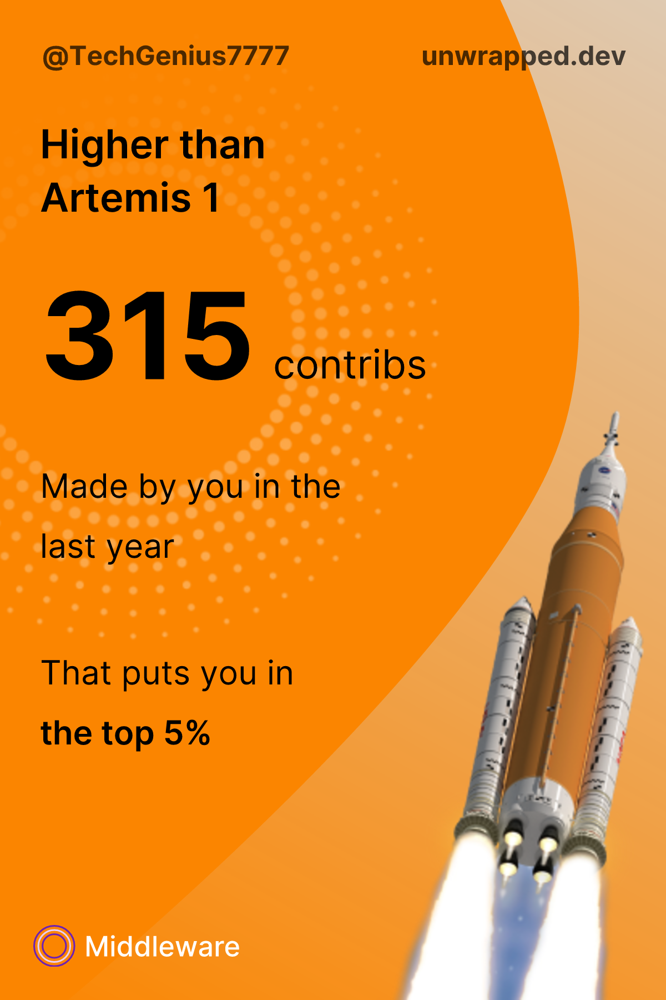
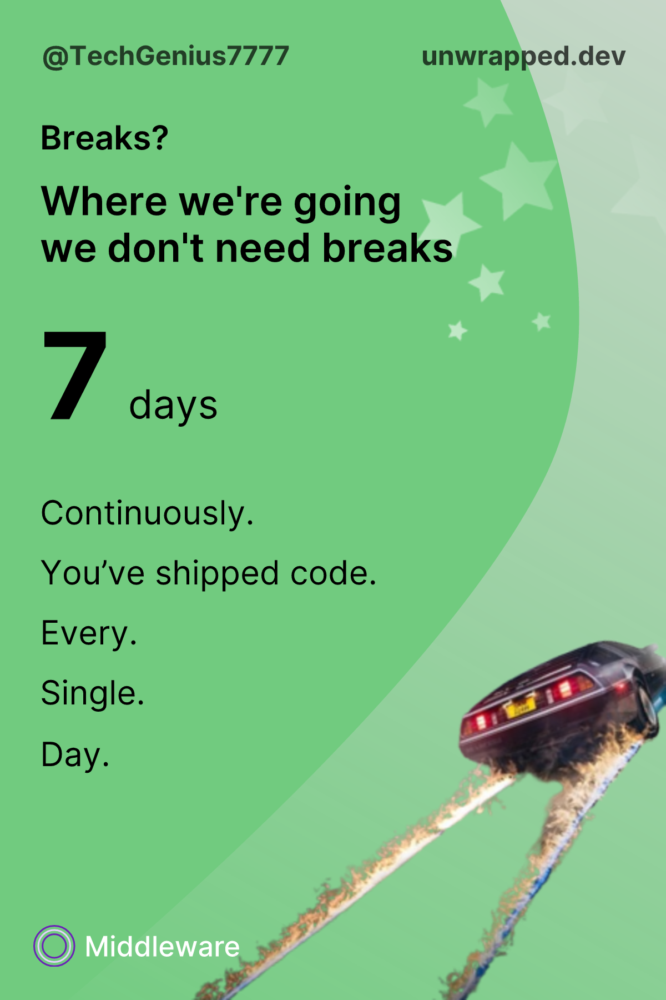
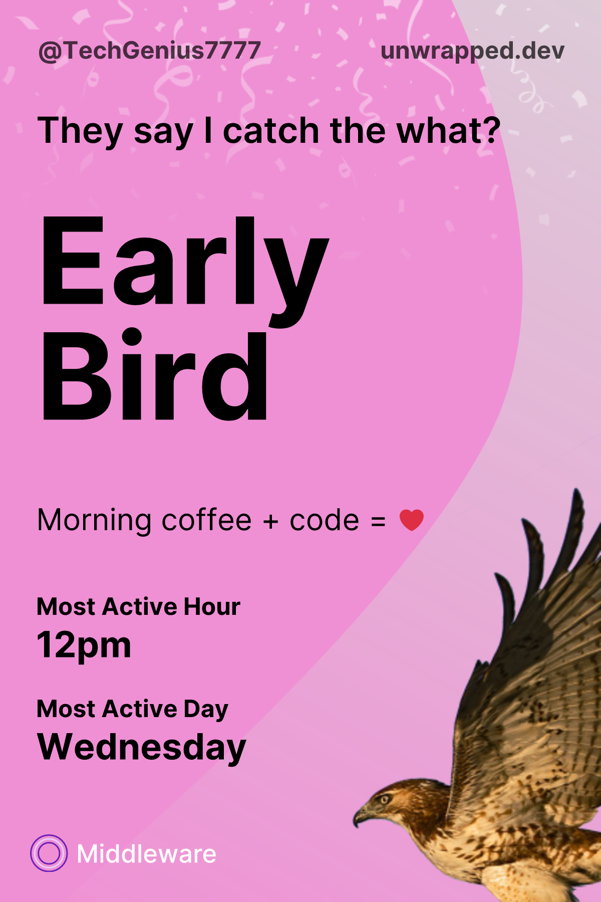
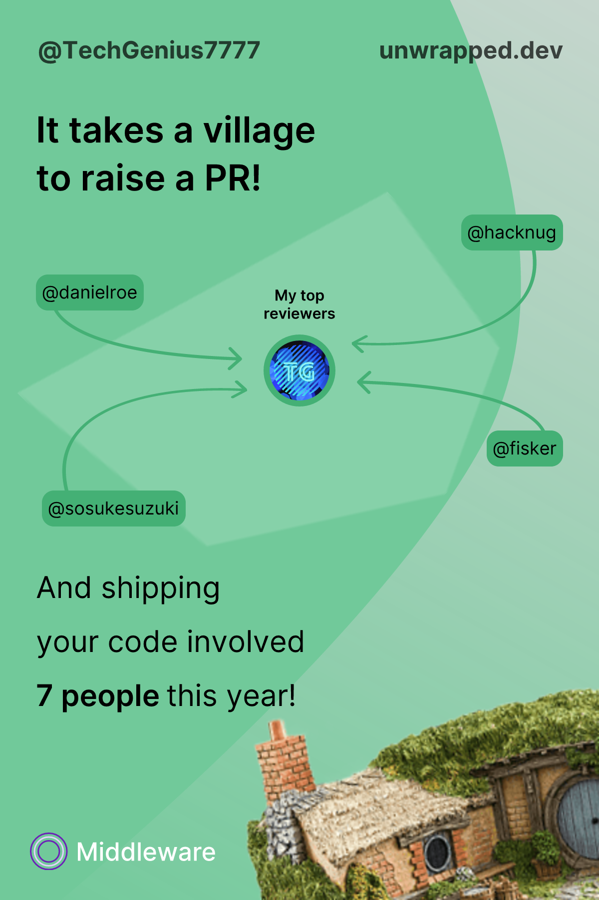

## About Me

Namaste! 🙏 Hey there! 👋

I'm **Supratik Mahato**, a driven Full-Stack and DevOps Developer with a passion for technology and innovation. My journey in tech started when I was in 4th grade, and since then, I've been on a mission to make the web a better place.

As an enthusiastic Open-Source contributor, I've had the privilege of working on projects that have positively impacted the developer community. Recently, I’ve been contributing to enhancing Developer Experience (DX) in [Nuxt.js](https://nuxt.com) and other projects. Beyond code, I’m also dedicated to improving documentation because clear, concise docs are essential for empowering developers and making tools accessible to everyone.

When I'm not coding, I'm usually diving into the latest tech trends, experimenting with new frameworks, or brainstorming ideas for my next project. I believe in continuous learning and love sharing my knowledge with others.

**Building the future, one line of code at a time. 🚀**

## Stats

## Nuxter

## Unwrapped 2023

<table>
  <tr>
    <td></td>
    <td></td>
    <td></td>
  </tr>
  <tr>
    <td></td>
    <td></td>
    <td></td>
  </tr>
  <tr>
    <td></td>
    <td></td>
    <td></td>
  </tr>
</table>
